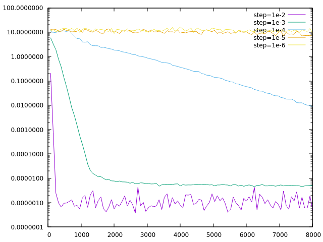
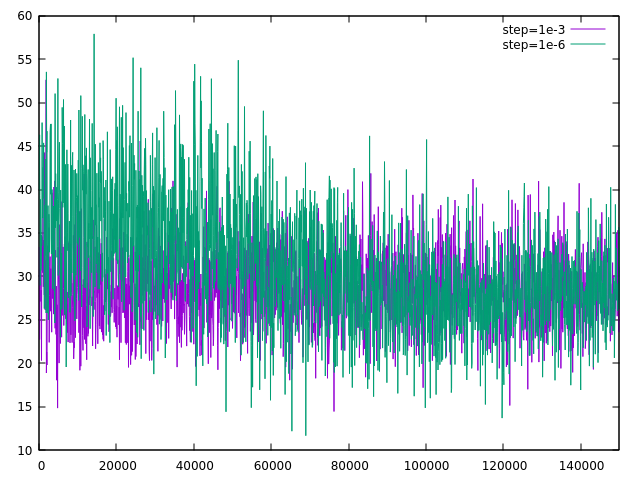

# 30 January, 2021

To demonstrate that backpropagation and gradient descent work robustly
in two-layer linear networks, at least for simple problems, 
I added unit tests to check a small number of steps along the computed 
gradient and an executable to output the progress of training over time.

The big lessons learned are that 
- NaN and infinite numeric values can quickly infect the network and render 
it useless;
- step-size choice is criticial for naive gradient descent.

LAIR has `debug_assert!()` through it to panic as soon as NaN and infinite 
values appear during training.
Enable these by compiling with `RUSTFLAGS="-C debug-assertion"`.

It remains a work in progress to separate the model/network representation
from training algorithms, but its current state, LAIR's gradient descent
uses a fixed step size specified at network configuration/creation.

In the presence of perfect examples, a large step size results in faster
convergence... unless it triggers numeric instability.
I produced the plot below using `target/debug/fit_quad -s $STEP_SZ` for
various step sizes to show progress of learning a simple linear function,
```
fn f(x: &Matrix2x1<Fxx>) -> Matrix1<Fxx> {
    Matrix1::<Fxx>::new(0.5 * x[0] - 4.0 * x[1] - 6.0)
}
```
Step sizes at least as large as 0.2 lead to numerical instability/NaN/inf 
trouble.
The plot shows the average error in testing over a 20-instance batch versus
the number of training examples.

The network is overspecified for the problem, but I am trying to gain
confidence in the backpropagation implementation.

### Convergence learning a linear function


In training for a quadratic function the errors are much larger and more-easily
lead to infinite intermediate values.
The model doesn't make convincing improvement, either, for the function
```
fn f(x: &Matrix2x1<Fxx>) -> Matrix1<Fxx> {
    Matrix1::<Fxx>::new(
        0.5 * x[0] * x[0] 
        + 2.0 * x[0] * x[1] 
        - 4.0 * x[1] * x[1] 
        - 6.0)
}
```
so I'm somewhat skeptical that there isn't an error in the backpropagation
implementation.

### Convergence learning a quadradic function


## Next Steps
- Tracking of network state/avoiding overflow.
- Implement sigmoid neurons.
- Experiment with simple classification.
